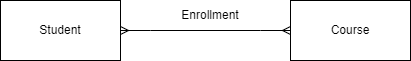
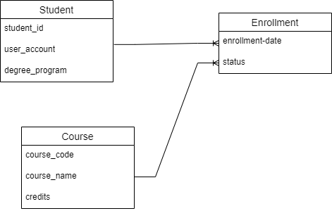
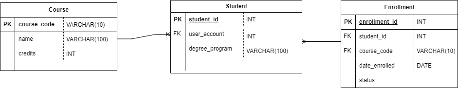

#  Degree Checklist Django Project

Attempted deployment using AWS EC2

This is for Assignment 2 - Models for CIDM-6325-70

#Conceptual Diagram

This diagram gives a high-level overview of the main entities involved in the system and their respective relationships.

## Logical Diagram

The logical diagram provides more details about the attributes of each entity and the nature of the relationships between them.

## Physical Diagram

The physical diagram represents how the entities, their attributes, and relationships are implemented in the actual database system. It includes primary and foreign keys, as well as the data types for each column.

---

User Stories
Course Entity:
Adding a New Course:

As an administrator, I want to add a new course to the system so that students can see and enroll in it.

Viewing Courses:

As a student, I want to view a list of all available courses so that I can decide which ones to enroll in.

Updating Course Details:

As an administrator, I want to update course details so that students always have the latest information.

Removing a Course:

As an administrator, I want to remove a course from the system if it's no longer offered.

Student Entity:
Student Profile Creation:

As a new student, I want to register and create a profile so that I can access the system and enroll in courses.

Updating Profile Information:

As a student, I want to edit my profile details to ensure my information is up-to-date.

Viewing Personal Course Enrollment:

As a student, I want to view all the courses I'm enrolled in so that I can manage my schedule.

Enrollment Entity:
Enrolling in a Course:

As a student, I want to enroll in a specific course so I can attend its lectures and gain credits upon completion.

Dropping a Course:

As a student, I want to unenroll or drop a course if I decide not to take it.

Checking Student Enrollment:

As a professor, I want to see all students enrolled in my course to plan my teaching accordingly.

Marking Course Completion:
As an administrator, I want to mark a course as completed for a student after they've satisfied all requirements, so that it reflects in their degree progression.

---

